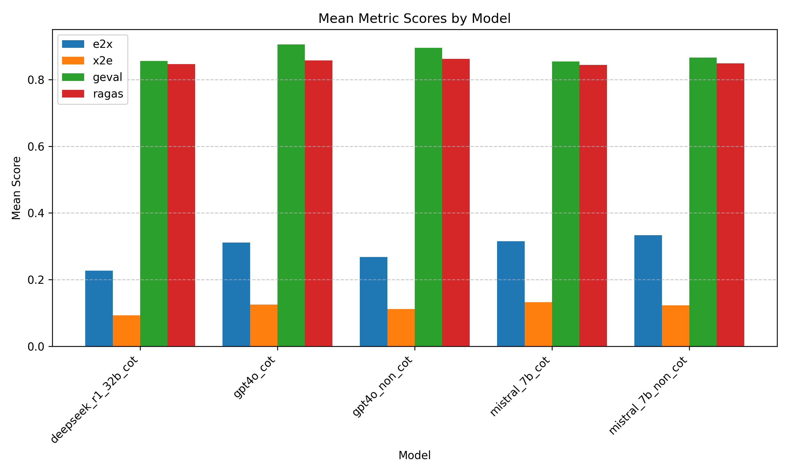
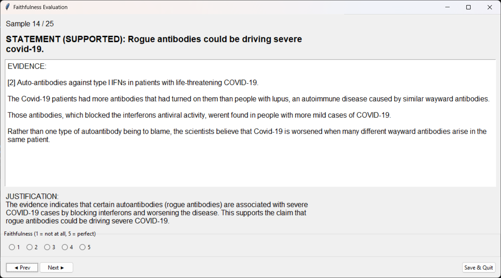

# NLP for Society: Fact-Checking Project

This repository contains the code and resources for a fact-checking project developed as part of the NLP for Society (NLP4Soc) course at TU Delft (DSAIT4100, 2025).

## Project Overview

This project evaluates the faithfulness of fact-checking explanations generated by various large language models. It includes:

- Data processing pipelines for multiple fact-checking datasets
- Inference scripts for generating fact-checking responses from LLMs
- Multiple evaluation frameworks for assessing faithfulness, including RAGAS, G-EVAL, Human-in-the-Loop, and entailment-based methods.
- Detailed analysis and visualization notebooks



## Human in the Loop Evaluation

The interactive Human-in-the-Loop (HITL) evaluation allows users to assess the faithfulness of model-generated explanations. See the GUI screenshot below for an example of the interface used to collect human feedback on model outputs.


## Repository Structure

- `archive/`: Original datasets and preparation scripts
  - Three fact-checking datasets: Hover, PolitiHop, and CovidFact
  - Prepared and unified dataset versions
- `experiments/`: Evaluation notebooks and utilities
  - Various faithfulness evaluation methods (RAGAS, G-EVAL, Entailment)
  - Analysis outputs and merged results
- `inference/`: Scripts for generating model outputs
  - Fact-checking pipelines for both local and API-based models
  - Raw and converted output formats
- `misc_notebooks/`: Analysis and utility notebooks
  - Results processing, visualization, and final analysis

## Setup Instructions

This project uses [UV](https://docs.astral.sh/uv/getting-started/installation/) as the package manager.

### Prerequisites

1. Install UV (if not already installed):

   ```bash
   pip install uv
   ```

   or follow the installation guide at [UV Installation](https://docs.astral.sh/uv/getting-started/installation/)

2. Install [Ollama](https://ollama.ai/) for local model inference

### Environment Setup

1. Create a virtual environment with notebook kernel support:

   ```bash
   uv venv
   ```

2. Install dependencies:

   ```bash
   uv sync
   ```

3. Activate the environment:

   ```bash
   # On Windows
   .venv\Scripts\activate
   # On Unix/macOS
   source .venv/bin/activate
   ```

## Models Used

- **GPT-4o**: Proprietary model accessed via OpenAI API
- **DeepSeek-R1:32B**: Distilled and quantized version available via Ollama (MIT License)
- **Mistral-7B**: Apache 2.0 Licensed model, used via Ollama
- **RoBERTa-Large-MNLI**: Apache 2.0 Licensed model for entailment classification
- **Llama 3–8B**: Meta's proprietary Llama 3 license (permitted for research use)

## Evaluation Frameworks

- **RAGAS**: Apache 2.0 Licensed framework for automated evaluation of Retrieval-Augmented Generation
- **GEVAL**: MIT Licensed framework for evaluation of natural language generation

## Datasets

- **Hover**: MIT Licensed dataset for fact-checking
- **PolitiHop**: Publicly available dataset for political claim verification
- **CovidFact**: Research dataset for COVID-19 fact extraction and verification

## Running Experiments

The main experiment notebooks are in the `experiments/` directory:

- `entailment_evaluation.ipynb`: Entailment-based faithfulness evaluation
- `geval_evaluation.ipynb`: G-EVAL framework evaluation
- `ragas_evaluation.ipynb`: RAGAS framework evaluation
- `human_in_the_loop_evaluation.ipynb`: Evaluation with human feedback

Final analysis and visualizations can be found in `misc_notebooks/final_analysis.ipynb`.

## Authors

- Samuel Goldie
- Jorden van Schijndel
- Franciszek Latała
- Razo van Berkel
- Deniz Çetin
